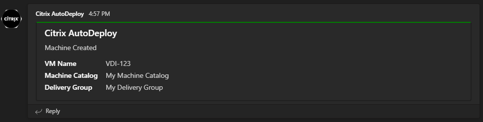

# Citrix Autodeploy for MCS
Monitors Citrix MCS delivery groups and automatically creates machines based on the number of machines you want always available to be assigned to users. The main goal of this is to eliminate the need to monitor your delivery groups and manually spin up machines when there aren't any left to be assigned.

## Prerequisites
### General
* Windows Server 2012+
* Powershell 5.1+
* Citrix (CVAD) Powershell snapins 1912 LTSR or later
* PSTeams Powershell module

> PSTeams module only required if you want to send notifications to an MS Teams channel

> Older versions may work but only these were tested

### Active Directory
Active Directory service account with permissions to create computer objects in the OU's used by your machine catalogs. See [this](https://support.citrix.com/article/CTX136282) link for details on the required Active Directory permissions.

### Citrix Studio
The Active Directory service account will need the 'Machine Catalog Administrator' and 'Delivery Group Administrator' roles.

## Setup
> I would not recommend running this directly on one of your delivery controllers. I run this on a management jump box.

Start Powershell as Administrator then run the following commands:

    git clone https://github.com/tonysathre/CitrixAutoDeploy.git
    cd CitrixAutoDeploy
    .\setup.ps1

The setup script performs the following:
* Create an Applications and Services event log called Citrix Autodeploy
* Create three scheduled tasks
  * Citrix Autodeploy
  * Citrix Autodeploy Error Monitor
  * Citrix Autodeploy Machine Creation Monitor
* Delegate the SeBatchLogonRight (Logon as a batch job) privilege to the Active Directory service account on the local machine

By default the task is set to start every day at 5:00 AM, and run every hour after that, but the settings can be modified in Task Scheduler. For testing you can run the Citrix Autodeploy scheduled task manually.

## Configuration
You will need to configure which machine catalogs and delivery groups you want to monitor in the [`citrix_autodeploy_config.json`](citrix_autodeploy_config.json.example). [`setup.ps1`](setup.ps1) will create this for you if it does not exist. The included example config file contains the following:
```json
{
    "AutodeployMonitors" : {
        "AutodeployMonitor": [
            {
                "AdminAddress" : "ddc1.example.com",
                "BrokerCatalog" : "Example Machine Catalog",
                "DesktopGroupName" : "Example Delivery Group",
                "MinAvailableMachines" : 5,
                "PreTask" : "C:\\Scripts\\pre-task.ps1",
                "PostTask" : "C:\\Scripts\\post-task.ps1"
            },
            {
                "AdminAddress" : "ddc2.example.com",
                "BrokerCatalog" : "Example Machine Catalog",
                "DesktopGroupName" : "Example Delivery Group",
                "MinAvailableMachines" : 1,
                "MaxMachinesInDesktopGroup" : 0,
                "MaxMachinesInBrokerCatalog" : 0,
                "PreTask" : "",
                "PostTask" : ""
            }
        ]
    }
}
```

> You can disable a job by setting `MinAvailableMachines` to `0`
>
> You can disable `MaxMachinesInDesktopGroup` and `MaxMachinesInBrokerCatalog` by not including them in the job definition, or by setting the value to `0`

|Attribute|Description|
|--- | ---|
|AdminAddress         | Delivery controller FQDN |
|BrokerCatalog        | Machine catalog name |
|DesktopGroupName     | Delivery group name |
|MinAvailableMachines | How many machines you want to be available at all times |
|MaxMachinesInBrokerCatalog | Limit the number of machines that can be added to the catalog |
|MaxMachinesInDesktopGroup | Limit the number of machines that can be added to the desktop group |
|PreTask              | Script to run before creating a new machine |
|PostTask             | Script to run after creating a new machine |

### Adding custom properties

You can add any custom properties to each object that you may need to use in a post-task script. For example, if you need machines created in a certain catalog added to specific AD groups, you could add a custom property called `ADGroups` to the object:

```json
{
    "AdminAddress" : "ddc2.example.com",
    "BrokerCatalog" : "Example Machine Catalog",
    "DesktopGroupName" : "Example Delivery Group",
    "MinAvailableMachines" : 1,
    "PreTask" : "",
    "PostTask" : "",
    "ADGroups" : ["SomeGroup", "SomeOtherGroup"]
}
```

Then in your post-task script, you can reference your custom property using the `$AutoDeployMonitor` variable:

```powershell
if (![string]::IsNullOrEmpty($AutoDeployMonitor.ADGroups)) {
    $ADObject = Get-AdComputer $NewBrokerMachine.MachineName.Split('\')[1]

    foreach ($ADGroup in $AutoDeployMonitor.ADGroups) {
        Add-ADGroupMember -Identity $ADGroup -Members $ADObject
    }
}
```

### Email alerts
For email alerts to function you must configure a[`citrix_autodeploy_config_email.json`](citrix_autodeploy_config_email.json.example). [`setup.ps1`](setup.ps1) will create this for you if it does not exist. You may also need to allow the machine running Citrix Autodeploy to relay email through your SMTP server.

```json
{
    "SmtpServer" : "smtp.example.com",
    "To" : ["email1@example.com", "email2@example.com"],
    "From" : "CitrixAutodeploy@example.com"
}
```

### MS Teams alerts
You can also send alerts to an Microsoft Teams channel.

1. [Create an incoming webhook](https://learn.microsoft.com/en-us/microsoftteams/platform/webhooks-and-connectors/how-to/add-incoming-webhook?tabs=dotnet) in Teams
2. Install the [PSTeams](https://github.com/EvotecIT/PSTeams) Powershell module on the machine running Citrix AutoDeploy
3. Put the following code in [citrix_autodeploy_monitor_machine_creation.ps1](citrix_autodeploy_monitor_machine_creation.ps1)

```powershell
Import-Module PSTeams
$Regex          = "'(.*?)'"
$Matches        = $Event.Message | Select-String -Pattern $Regex -AllMatches | Foreach-Object { $_.Matches }
$MachineCatalog = $Matches[0].Value.Trim("'")
$DeliveryGroup  = $Matches[1].Value.Trim("'")
$VM             = $(($Event.Message -split ' ')[3])

$Uri   = '<YOUR WEBHOOK URL HERE>'
$Color = 'Green'
$Fact1 = New-TeamsFact -Name 'VM Name' -Value $VM
$Fact2 = New-TeamsFact -Name 'Machine Catalog' -Value $MachineCatalog
$Fact3 = New-TeamsFact -Name 'Delivery Group' -Value $DeliveryGroup

$TeamsSection = @{
    ActivityDetails = $Fact1, $Fact2, $Fact3
}

$Sections = New-TeamsSection @TeamsSection

$TeamsMessage = @{
    Uri          = $Uri
    MessageTitle = 'Citrix AutoDeploy'
    MessageText  = 'Machine Created'
    Color        = $Color
    Sections     = $Sections
}

Send-TeamsMessage @TeamsMessage
```

Here's an example MS Teams notification:



The two included monitor scripts will send alerts for event ID's 1 and 3 by default. You can get additional alerts by creating scheduled tasks that trigger on the different event ID's described below.

### Events and logging
|Event ID|Details|
|-- | --|
|0|<pre>Autodeploy job started: <br><br>AdminAddress         : ddc1.example.com <br>BrokerCatalog        : Example Machine Catalog <br>DesktopGroupName     : Example Delivery Group <br>MinAvailableMachines : 1 <br>PreTask              :  <br>PostTask             : C:\\Scripts\\post-task.ps1</pre>|
|1|All **errors** report as event ID 1 to simplify alerting|
|2|```Creating VM VMName in catalog 'Example Machine Catalog' and adding to delivery group 'Example Delivery Group'```|
|3|```Successfully created VM VMName in catalog 'Example Machine Catalog' and added it to delivery group 'Example Delivery Group'```|
|4|<pre>No machines needed for desktop group 'Example Delivery Group'<br>Available machines: 1<br>Required available machines: 1<br><br>Available machine names:<br>VMName.example.com<br></pre>|
|5|<pre>Executing pre-task 'C:\Scripts\pre-task.ps1' for desktop group Example Delivery Group</pre>|
|6|<pre>Executing post-task 'C:\Scripts\post-task.ps1' for desktop group Example Delivery Group</pre>|
|7|<pre>Pre-task output<br><br>_Some script output_</pre>|
|8|<pre>Post-task output<br><br>_Some script output_</pre>|

### Pre and post deployment tasks
You can define a script to run in the [`citrix_autodeploy_config.json`](citrix_autodeploy_config.json.example) before each machine is created, and after each machine is created. This can be useful for things such as putting a machine in maintenance mode or registering it with your CMDB. A couple examples are included in [`post-task-examples`](post-task-examples) folder.

Here is an example post-task that puts the newly created machine into maintenance mode, and then powers it on:

```powershell
Set-BrokerMachineMaintenanceMode -AdminAddress $AdminAddress -InputObject $NewBrokerMachine -MaintenanceMode $true
New-BrokerHostingPowerAction -AdminAddress $AdminAddress -MachineName $NewBrokerMachine.MachineName -Action TurnOn
```
The following variables can be used in pre and post-task scripts:

|Variable|Data Type|Availability|
|-- | --| --|
|$AutoDeployMonitor|PSCustomObject|Pre and Post|
|$AdminAddress|System.String|Pre and Post|
|$BrokerCatalog|Citrix.Broker.Admin.SDK.Catalog|Pre and Post|
|$DesktopGroupName|Citrix.Broker.Admin.SDK.DesktopGroup|Pre and Post|
|$UnassignedMachines|Citrix.Broker.Admin.SDK.Desktop|Pre and Post|
|$MachinesToAdd|System.Int32|Pre and Post|
|$PreTask|System.String|Pre and Post|
|$PostTask|System.String|Pre and Post|
|$PreTaskOutput|Depends on task output|Post|
|$IdentityPool|Citrix.ADIdentity.Sdk.IdentityPool|Post|
|$NewAdAccount|Citrix.ADIdentity.Sdk.AccountOperationDetailedSummary|Post|
|$ProvScheme|Citrix.MachineCreation.Sdk.ProvisioningScheme|Post|
|$NewVMProvTask|System.Guid|Post|
|$NewBrokerMachine|Citrix.Broker.Admin.Sdk.Machine|Post|

### Troubleshooting and Common Errors
|Event log error|Solution|
|-- | --|
|```Cannot validate argument on parameter 'ADAccountName'. The number of provided arguments (0) is fewer than the minimum number of allowed arguments (1). Provide more than 1 arguments, and then try the command again.```|Ensure the service account has the proper permissions on the OU.
```The term 'Get-BrokerCatalog' is not recognized as the name of a cmdlet, function, script file, or operable program. Check the spelling of the name, or if a path was included, verify that the path is correct and try again.```|Ensure the Powershell snapins are installed. These can be installed standalone from the CVAD ISO or with Citrix Studio.
|```Failed to connect to back-end server 'ddc1.example.com' on port 80 using binding WSHttp. The server may be off-line or may not be running the appropriate service```|Double-check the AdminAddress defined in the [`citrix_autodeploy_config.json`](citrix_autodeploy_config.json.example).
|```Insufficient administrative privilege```|Ensure the service account has been added to the 'Machine Catalog Administrator' and 'Delivery Group Administrator' roles in Citrix Studio.
